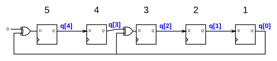

# 110. 5-bit LFSR

**Section:** Circuits — Sequential Logic — Shift Registers  
**HDLBits:** [5-bit LFSR](https://hdlbits.01xz.net/wiki/Lfsr5)

## Problem

5-bit Galois LFSR. Bit numbering q[4:0] corresponds to positions 5..1
in the figure. XOR tap at position 3 (q[2]). Synchronous reset to 1.
q <= {0 xor q[0], q[4], q[3] xor q[0], q[2], q[1]} with Galois
form: shift toward MSB, feedback into LSB, XOR into tap.
Fibonacci equivalent used here: q <= {q[3:0], q[4] ^ q[2]}.

## Figures (from HDLBits)

Copied from the official HDLBits problem page for this tutorial.



## Solution

The module is named `top_module` so you can paste it into HDLBits. The same source is in [`110_lfsr5.v`](./110_lfsr5.v).

```verilog
module top_module (
    input            clk,
    input            reset,
    output reg [4:0] q
);
    always @(posedge clk) begin
        if (reset)
            q <= 5'h1;
        else
            q <= {q[0], q[4], q[3] ^ q[0], q[2], q[1]};
    end
endmodule
```
