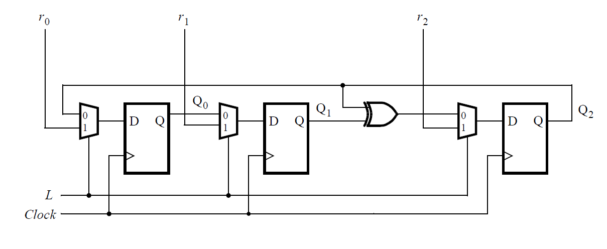

# 111. 3-bit LFSR

**Section:** Circuits — Sequential Logic — Shift Registers  
**HDLBits:** [3-bit LFSR](https://hdlbits.01xz.net/wiki/Mt2015_lfsr)

## Problem

3-bit LFSR with parallel load. Ports match the exam (SW/KEY/LEDR):
  clk = KEY[0], L = KEY[1], R = SW[2:0], Q = LEDR[2:0]
When L=1, load SW. Otherwise:
  q[2] <= q[1]
  q[1] <= q[0]
  q[0] <= q[2] ^ q[1]

## Figures (from HDLBits)

Copied from the official HDLBits problem page for this tutorial.



## Solution

The module is named `top_module` so you can paste it into HDLBits. The same source is in [`111_mt2015_lfsr.v`](./111_mt2015_lfsr.v).

```verilog
module top_module (
    input  [2:0] SW,
    input  [1:0] KEY,
    output [2:0] LEDR
);
    wire clk = KEY[0];
    wire L   = KEY[1];
    reg  [2:0] Q;
    always @(posedge clk) begin
        if (L)
            Q <= SW;
        else
            Q <= {Q[1], Q[0], Q[2] ^ Q[1]};
    end
    assign LEDR = Q;
endmodule
```
