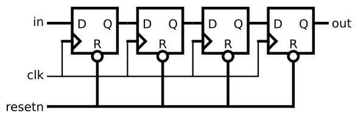

# 113. Shift register

**Section:** Circuits — Sequential Logic — Shift Registers  
**HDLBits:** [Shift register](https://hdlbits.01xz.net/wiki/Exams/m2014_q4k)

## Problem

4-bit shift register, active-low synchronous reset. Shift in `in` at
the LSB; `out` is the MSB. resetn=0 clears to 0.

## Figures (from HDLBits)

Copied from the official HDLBits problem page for this tutorial.



## Solution

The module is named `top_module` so you can paste it into HDLBits. The same source is in [`113_m2014_q4k.v`](./113_m2014_q4k.v).

```verilog
module top_module (
    input      clk,
    input      resetn,
    input      in,
    output     out
);
    reg [3:0] q;
    always @(posedge clk) begin
        if (!resetn)
            q <= 4'd0;
        else
            q <= {q[2:0], in};
    end
    assign out = q[3];
endmodule
```
