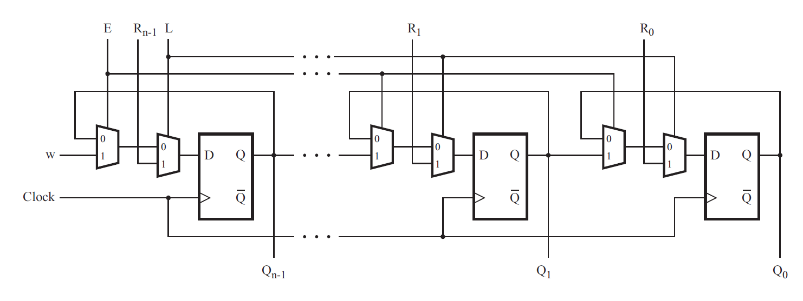

# 114. Shift register

**Section:** Circuits — Sequential Logic — Shift Registers  
**HDLBits:** [Shift register](https://hdlbits.01xz.net/wiki/Exams/2014_q4b)

## Problem

4-bit shift register built from the mux+DFF cell of 2014_q4a.
FPGA-board ports: KEY[0]=clk, KEY[1]=E, KEY[2]=L, KEY[3]=w,
SW[3:0]=R, LEDR[3:0]=Q. Chain w into Q[0], Q[0] into Q[1], ...

## Figures (from HDLBits)

Copied from the official HDLBits problem page for this tutorial.



## Solution

The module is named `top_module` so you can paste it into HDLBits. The same source is in [`114_2014_q4b.v`](./114_2014_q4b.v).

```verilog
module top_module (
    input  [3:0] SW,
    input  [3:0] KEY,
    output [3:0] LEDR
);
    muxdff u0 (.clk(KEY[0]), .w(KEY[3]),   .R(SW[0]), .E(KEY[1]), .L(KEY[2]), .Q(LEDR[0]));
    muxdff u1 (.clk(KEY[0]), .w(LEDR[0]),  .R(SW[1]), .E(KEY[1]), .L(KEY[2]), .Q(LEDR[1]));
    muxdff u2 (.clk(KEY[0]), .w(LEDR[1]),  .R(SW[2]), .E(KEY[1]), .L(KEY[2]), .Q(LEDR[2]));
    muxdff u3 (.clk(KEY[0]), .w(LEDR[2]),  .R(SW[3]), .E(KEY[1]), .L(KEY[2]), .Q(LEDR[3]));
endmodule

module muxdff (
    input      clk,
    input      w, R, E, L,
    output reg Q
);
    always @(posedge clk) begin
        if (L)
            Q <= R;
        else if (E)
            Q <= w;
    end
endmodule
```
