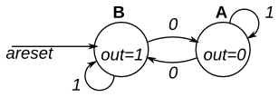

# 119. Simple FSM 1 (asynchronous reset)

**Section:** Circuits — Sequential Logic — Finite State Machines  
**HDLBits:** [Simple FSM 1 (asynchronous reset)](https://hdlbits.01xz.net/wiki/Fsm1)

## Problem

Two-state Moore FSM. States A (out=0) and B (out=1). Asynchronous
reset to B. Input `in`: if 1 stay; if 0 go to the other state.

## Figures (from HDLBits)

Copied from the official HDLBits problem page for this tutorial.



## Solution

The module is named `top_module` so you can paste it into HDLBits. The same source is in [`119_fsm1.v`](./119_fsm1.v).

```verilog
module top_module (
    input      clk,
    input      areset,
    input      in,
    output     out
);
    parameter A = 1'b0, B = 1'b1;
    reg state, next;
    always @(*) begin
        case (state)
            A: next = in ? A : B;
            B: next = in ? B : A;
        endcase
    end
    always @(posedge clk or posedge areset) begin
        if (areset)
            state <= B;
        else
            state <= next;
    end
    assign out = (state == B);
endmodule
```
