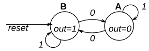

# 120. Simple FSM 1 (synchronous reset)

**Section:** Circuits — Sequential Logic — Finite State Machines  
**HDLBits:** [Simple FSM 1 (synchronous reset)](https://hdlbits.01xz.net/wiki/Fsm1s)

## Problem

Same as fsm1 but the reset is synchronous (and named `reset`).

## Figures (from HDLBits)

Copied from the official HDLBits problem page for this tutorial.



## Solution

The module is named `top_module` so you can paste it into HDLBits. The same source is in [`120_fsm1s.v`](./120_fsm1s.v).

```verilog
module top_module (
    input      clk,
    input      reset,
    input      in,
    output     out
);
    parameter A = 1'b0, B = 1'b1;
    reg state, next;
    always @(*) begin
        case (state)
            A: next = in ? A : B;
            B: next = in ? B : A;
        endcase
    end
    always @(posedge clk) begin
        if (reset)
            state <= B;
        else
            state <= next;
    end
    assign out = (state == B);
endmodule
```
