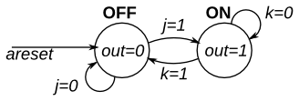

# 121. Simple FSM 2 (asynchronous reset)

**Section:** Circuits — Sequential Logic — Finite State Machines  
**HDLBits:** [Simple FSM 2 (asynchronous reset)](https://hdlbits.01xz.net/wiki/Fsm2)

## Problem

Two-state Moore FSM. Reset (async) to OFF (out=0).
  OFF: out=0; in=0 stay, in=1 go ON
  ON : out=1; in=1 stay, in=0 go OFF

## Figures (from HDLBits)

Copied from the official HDLBits problem page for this tutorial.



## Solution

The module is named `top_module` so you can paste it into HDLBits. The same source is in [`121_fsm2.v`](./121_fsm2.v).

```verilog
module top_module (
    input      clk,
    input      areset,
    input      j,
    input      k,
    output     out
);
    parameter OFF = 1'b0, ON = 1'b1;
    reg state, next;
    always @(*) begin
        case (state)
            OFF: next = j ? ON  : OFF;
            ON : next = k ? OFF : ON;
        endcase
    end
    always @(posedge clk or posedge areset) begin
        if (areset)
            state <= OFF;
        else
            state <= next;
    end
    assign out = (state == ON);
endmodule
```
