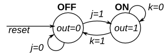

# 122. Simple FSM 2 (synchronous reset)

**Section:** Circuits — Sequential Logic — Finite State Machines  
**HDLBits:** [Simple FSM 2 (synchronous reset)](https://hdlbits.01xz.net/wiki/Fsm2s)

## Problem

Same as fsm2 with synchronous reset. Ports are clk, reset, j, k, out.

## Figures (from HDLBits)

Copied from the official HDLBits problem page for this tutorial.



## Solution

The module is named `top_module` so you can paste it into HDLBits. The same source is in [`122_fsm2s.v`](./122_fsm2s.v).

```verilog
module top_module (
    input      clk,
    input      reset,
    input      j,
    input      k,
    output     out
);
    parameter OFF = 1'b0, ON = 1'b1;
    reg state, next;
    always @(*) begin
        case (state)
            OFF: next = j ? ON  : OFF;
            ON : next = k ? OFF : ON;
        endcase
    end
    always @(posedge clk) begin
        if (reset)
            state <= OFF;
        else
            state <= next;
    end
    assign out = (state == ON);
endmodule
```
