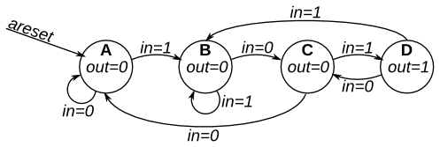

# 125. Simple FSM 3 (asynchronous reset)

**Section:** Circuits — Sequential Logic — Finite State Machines  
**HDLBits:** [Simple FSM 3 (asynchronous reset)](https://hdlbits.01xz.net/wiki/Fsm3)

## Problem

The full 4-state FSM of fsm3comb, with asynchronous reset to A.

## Figures (from HDLBits)

Copied from the official HDLBits problem page for this tutorial.



## Solution

The module is named `top_module` so you can paste it into HDLBits. The same source is in [`125_fsm3.v`](./125_fsm3.v).

```verilog
module top_module (
    input        clk,
    input        in,
    input        areset,
    output       out
);
    parameter A = 2'd0, B = 2'd1, C = 2'd2, D = 2'd3;
    reg [1:0] state, next;
    always @(*) begin
        case (state)
            A: next = in ? B : A;
            B: next = in ? B : C;
            C: next = in ? D : A;
            D: next = in ? B : C;
            default: next = A;
        endcase
    end
    always @(posedge clk or posedge areset) begin
        if (areset)
            state <= A;
        else
            state <= next;
    end
    assign out = (state == D);
endmodule
```
