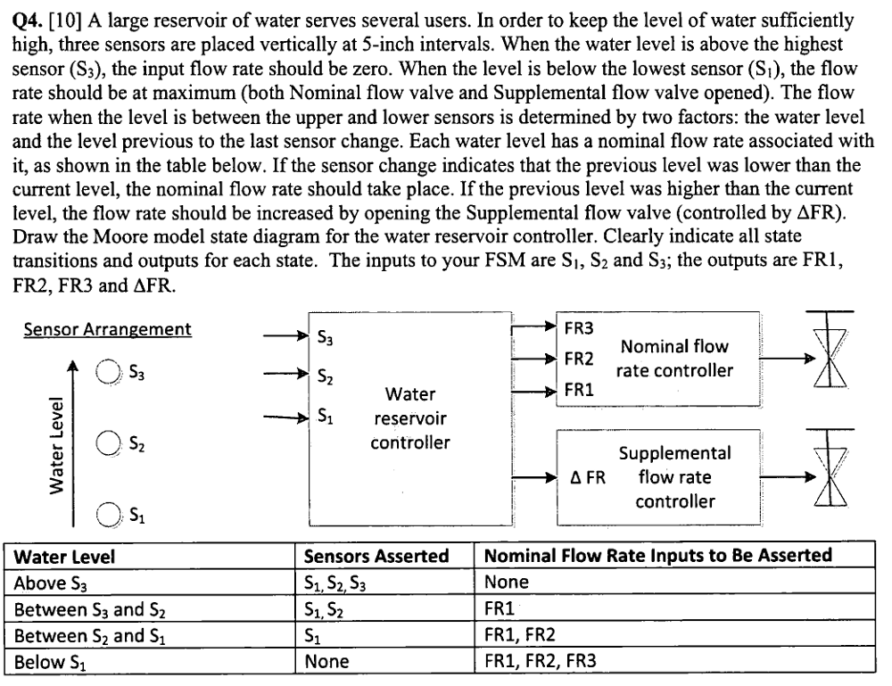

# 127. Design a Moore FSM

**Section:** Circuits — Sequential Logic — Finite State Machines  
**HDLBits:** [Design a Moore FSM](https://hdlbits.01xz.net/wiki/Exams/ece241_2013_q4)

## Problem

Water-level controller. Sensors s[2:0] (s[0] bottom, s[2] top) are 1
when water is above that sensor (and sensors below are also 1).
Outputs fr1,fr2,fr3 are flow-rate valves (1=open). dfr is a faster
extra valve asserted when the previous level was lower than now
(water is rising) except immediately after reset.
Reset (async): all fr on, dfr off, as if the tank were empty.
  above s2: all fr off
  between s1 and s2: fr1
  between s0 and s1: fr1+fr2
  below s0: fr1+fr2+fr3

## Figures (from HDLBits)

Copied from the official HDLBits problem page for this tutorial.



## Solution

The module is named `top_module` so you can paste it into HDLBits. The same source is in [`127_ece241_2013_q4.v`](./127_ece241_2013_q4.v).

```verilog
module top_module (
    input        clk,
    input        reset,
    input  [2:0] s,
    output       fr3,
    output       fr2,
    output       fr1,
    output       dfr
);
    parameter A = 2'd0, B = 2'd1, C = 2'd2, D = 2'd3;
    reg [1:0] state, next, prev;
    always @(*) begin
        case (s)
            3'b000: next = A;
            3'b001: next = B;
            3'b011: next = C;
            3'b111: next = D;
            default: next = state;
        endcase
    end
    always @(posedge clk) begin
        if (reset) begin
            state <= A;
            prev  <= A;
        end else begin
            prev  <= state;
            state <= next;
        end
    end
    assign fr1 = (state != D);
    assign fr2 = (state == A) || (state == B);
    assign fr3 = (state == A);
    assign dfr = (state > prev);
endmodule
```
