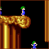
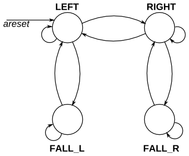
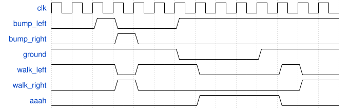

# 129. Lemmings 2

**Section:** Circuits — Sequential Logic — Finite State Machines  
**HDLBits:** [Lemmings 2](https://hdlbits.01xz.net/wiki/Lemmings2)

## Problem

Lemmings 1 plus `aaah` which is 1 while falling.

## Figures (from HDLBits)

Copied from the official HDLBits problem page for this tutorial.







## Solution

The module is named `top_module` so you can paste it into HDLBits. The same source is in [`129_lemmings2.v`](./129_lemmings2.v).

```verilog
module top_module (
    input      clk,
    input      areset,
    input      bump_left,
    input      bump_right,
    input      ground,
    output     walk_left,
    output     walk_right,
    output     aaah
);
    parameter LEFT = 1'b0, RIGHT = 1'b1;
    parameter WALK = 1'b0, FALL = 1'b1;
    reg dir, mode;
    always @(posedge clk or posedge areset) begin
        if (areset) begin
            dir  <= LEFT;
            mode <= WALK;
        end else begin
            if (!ground)
                mode <= FALL;
            else begin
                mode <= WALK;
                if (mode == WALK) begin
                    if (bump_left && bump_right)
                        dir <= ~dir;
                    else if (bump_left)
                        dir <= RIGHT;
                    else if (bump_right)
                        dir <= LEFT;
                end
            end
        end
    end
    assign walk_left  = (mode == WALK) && (dir == LEFT);
    assign walk_right = (mode == WALK) && (dir == RIGHT);
    assign aaah       = (mode == FALL);
endmodule
```
