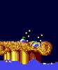
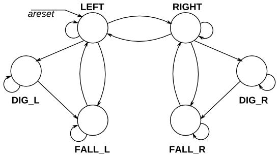
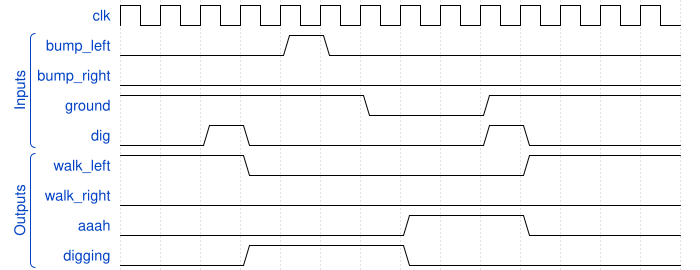

# 130. Lemmings 3

**Section:** Circuits — Sequential Logic — Finite State Machines  
**HDLBits:** [Lemmings 3](https://hdlbits.01xz.net/wiki/Lemmings3)

## Problem

Lemmings 2 plus digging. `dig` is requested; if on ground and not
already falling, start digging (`digging`=1, walk=0, aaah=0) until
ground disappears (then fall). Digging does not change direction.
Cannot dig while falling. Bumps are ignored while digging.

## Figures (from HDLBits)

Copied from the official HDLBits problem page for this tutorial.







## Solution

The module is named `top_module` so you can paste it into HDLBits. The same source is in [`130_lemmings3.v`](./130_lemmings3.v).

```verilog
module top_module (
    input      clk,
    input      areset,
    input      bump_left,
    input      bump_right,
    input      ground,
    input      dig,
    output     walk_left,
    output     walk_right,
    output     aaah,
    output     digging
);
    parameter LEFT=0, RIGHT=1;
    parameter WALK=0, FALL=1, DIG=2;
    reg dir;
    reg [1:0] state;
    always @(posedge clk or posedge areset) begin
        if (areset) begin
            dir   <= LEFT;
            state <= WALK;
        end else begin
            case (state)
                WALK: begin
                    if (!ground)
                        state <= FALL;
                    else if (dig)
                        state <= DIG;
                    else if (bump_left && bump_right)
                        dir <= ~dir;
                    else if (bump_left)
                        dir <= RIGHT;
                    else if (bump_right)
                        dir <= LEFT;
                end
                FALL: begin
                    if (ground)
                        state <= WALK;
                end
                DIG: begin
                    if (!ground)
                        state <= FALL;
                end
            endcase
        end
    end
    assign walk_left  = (state == WALK) && (dir == LEFT);
    assign walk_right = (state == WALK) && (dir == RIGHT);
    assign aaah       = (state == FALL);
    assign digging    = (state == DIG);
endmodule
```
