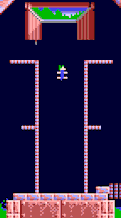
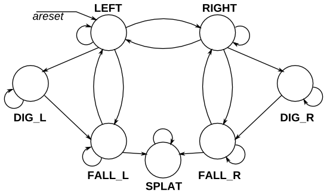
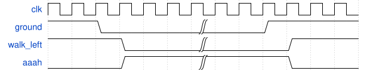
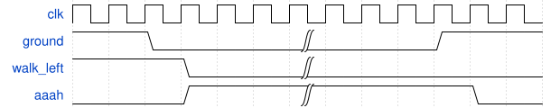

# 131. Lemmings 4

**Section:** Circuits — Sequential Logic — Finite State Machines  
**HDLBits:** [Lemmings 4](https://hdlbits.01xz.net/wiki/Lemmings4)

## Problem

Lemmings 3 plus splatter: if the lemming falls for more than 20
clock cycles, then when it hits the ground it is squished
(`walk_*`=`aaah`=`digging`=0 forever). Falling for exactly 20
cycles is still safe.

## Figures (from HDLBits)

Copied from the official HDLBits problem page for this tutorial.









## Solution

The module is named `top_module` so you can paste it into HDLBits. The same source is in [`131_lemmings4.v`](./131_lemmings4.v).

```verilog
module top_module (
    input      clk,
    input      areset,
    input      bump_left,
    input      bump_right,
    input      ground,
    input      dig,
    output     walk_left,
    output     walk_right,
    output     aaah,
    output     digging
);
    parameter LEFT=0, RIGHT=1;
    parameter WALK=0, FALL=1, DIG=2, DEAD=3;
    reg dir;
    reg [1:0] state;
    reg [4:0] fall_cnt;
    always @(posedge clk or posedge areset) begin
        if (areset) begin
            dir      <= LEFT;
            state    <= WALK;
            fall_cnt <= 5'd0;
        end else begin
            case (state)
                WALK: begin
                    fall_cnt <= 5'd0;
                    if (!ground)
                        state <= FALL;
                    else if (dig)
                        state <= DIG;
                    else if (bump_left && bump_right)
                        dir <= ~dir;
                    else if (bump_left)
                        dir <= RIGHT;
                    else if (bump_right)
                        dir <= LEFT;
                end
                FALL: begin
                    if (fall_cnt < 5'd21)
                        fall_cnt <= fall_cnt + 5'd1;
                    if (ground)
                        state <= (fall_cnt > 5'd20) ? DEAD : WALK;
                end
                DIG: begin
                    if (!ground) begin
                        state    <= FALL;
                        fall_cnt <= 5'd0;
                    end
                end
                DEAD: state <= DEAD;
            endcase
        end
    end
    assign walk_left  = (state == WALK) && (dir == LEFT);
    assign walk_right = (state == WALK) && (dir == RIGHT);
    assign aaah       = (state == FALL);
    assign digging    = (state == DIG);
endmodule
```
