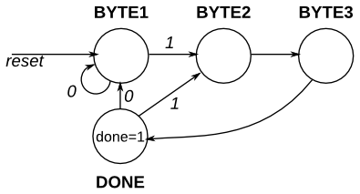
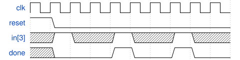
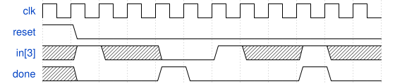
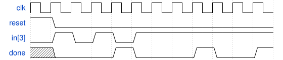

# 133. PS/2 packet parser

**Section:** Circuits — Sequential Logic — Finite State Machines  
**HDLBits:** [PS/2 packet parser](https://hdlbits.01xz.net/wiki/Fsm_ps2)

## Problem

Parse a PS/2 3-byte packet. Bytes arrive in `in[7:0]` when `in[3:0]`
of the first byte is 4'h8..4'hB (bits [3] of the first byte is 1).
`done` is 1 for one cycle after the third byte of a valid packet.
Synchronous reset.

## Figures (from HDLBits)

Copied from the official HDLBits problem page for this tutorial.









## Solution

The module is named `top_module` so you can paste it into HDLBits. The same source is in [`133_fsm_ps2.v`](./133_fsm_ps2.v).

```verilog
module top_module (
    input        clk,
    input        reset,
    input  [7:0] in,
    output       done
);
    parameter B1=0, B2=1, B3=2, DN=3;
    reg [1:0] state, next;
    always @(*) begin
        case (state)
            B1: next = in[3] ? B2 : B1;
            B2: next = B3;
            B3: next = DN;
            DN: next = in[3] ? B2 : B1;
            default: next = B1;
        endcase
    end
    always @(posedge clk) begin
        if (reset)
            state <= B1;
        else
            state <= next;
    end
    assign done = (state == DN);
endmodule
```
