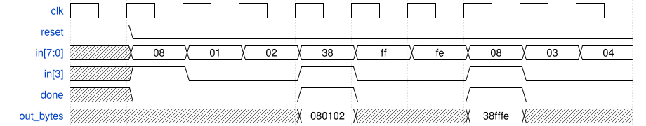

# 134. PS/2 packet parser and datapath

**Section:** Circuits — Sequential Logic — Finite State Machines  
**HDLBits:** [PS/2 packet parser and datapath](https://hdlbits.01xz.net/wiki/Fsm_ps2data)

## Problem

Same parser, also capture the 24-bit packet `out_bytes` when done.

## Figures (from HDLBits)

Copied from the official HDLBits problem page for this tutorial.



## Solution

The module is named `top_module` so you can paste it into HDLBits. The same source is in [`134_fsm_ps2data.v`](./134_fsm_ps2data.v).

```verilog
module top_module (
    input             clk,
    input             reset,
    input       [7:0] in,
    output            done,
    output reg [23:0] out_bytes
);
    parameter B1=0, B2=1, B3=2, DN=3;
    reg [1:0] state, next;
    reg [7:0] b1, b2, b3;
    always @(*) begin
        case (state)
            B1: next = in[3] ? B2 : B1;
            B2: next = B3;
            B3: next = DN;
            DN: next = in[3] ? B2 : B1;
            default: next = B1;
        endcase
    end
    always @(posedge clk) begin
        if (reset)
            state <= B1;
        else begin
            state <= next;
            if (next == B2 && (state == B1 || state == DN))
                b1 <= in;
            if (state == B2)
                b2 <= in;
            if (state == B3)
                b3 <= in;
        end
    end
    assign done = (state == DN);
    always @(*) out_bytes = {b1, b2, b3};
endmodule
```
