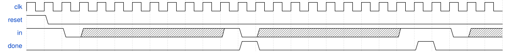
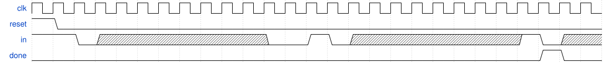

# 135. Serial receiver

**Section:** Circuits — Sequential Logic — Finite State Machines  
**HDLBits:** [Serial receiver](https://hdlbits.01xz.net/wiki/Fsm_serial)

## Problem

UART-like receiver: idle until a start bit 0, then 8 data bits
(LSB first), then a stop bit 1. `done` is 1 for one cycle if the
stop bit is 1. If stop is 0, wait until the line goes back to 1
(idle) before looking for a new start bit. Synchronous reset.

## Figures (from HDLBits)

Copied from the official HDLBits problem page for this tutorial.





## Solution

The module is named `top_module` so you can paste it into HDLBits. The same source is in [`135_fsm_serial.v`](./135_fsm_serial.v).

```verilog
module top_module (
    input      clk,
    input      reset,
    input      in,
    output     done
);
    parameter IDLE=0, DATA=1, STOP=2, WAIT=3, DONE=4;
    reg [2:0] state, next;
    reg [2:0] cnt, cnt_next;
    always @(*) begin
        next     = state;
        cnt_next = cnt;
        case (state)
            IDLE: begin
                if (in == 1'b0) begin
                    next     = DATA;
                    cnt_next = 3'd0;
                end
            end
            DATA: begin
                if (cnt == 3'd7)
                    next = STOP;
                cnt_next = cnt + 3'd1;
            end
            STOP: next = in ? DONE : WAIT;
            WAIT: if (in) next = IDLE;
            DONE: next = in ? IDLE : DATA;
            default: next = IDLE;
        endcase
    end
    always @(posedge clk) begin
        if (reset) begin
            state <= IDLE;
            cnt   <= 3'd0;
        end else begin
            state <= next;
            cnt   <= cnt_next;
        end
    end
    assign done = (state == DONE);
endmodule
```
