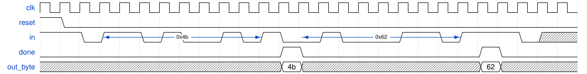

# 136. Serial receiver and datapath

**Section:** Circuits — Sequential Logic — Finite State Machines  
**HDLBits:** [Serial receiver and datapath](https://hdlbits.01xz.net/wiki/Fsm_serialdata)

## Problem

Same serial receiver, also output the received byte `out_byte` when done.

## Figures (from HDLBits)

Copied from the official HDLBits problem page for this tutorial.



## Solution

The module is named `top_module` so you can paste it into HDLBits. The same source is in [`136_fsm_serialdata.v`](./136_fsm_serialdata.v).

```verilog
module top_module (
    input            clk,
    input            reset,
    input            in,
    output           done,
    output reg [7:0] out_byte
);
    parameter IDLE=0, DATA=1, STOP=2, WAIT=3, DONE=4;
    reg [2:0] state, next;
    reg [2:0] bitn;
    reg [7:0] data;
    always @(*) begin
        next = state;
        case (state)
            IDLE: if (!in) next = DATA;
            DATA: next = (bitn == 3'd7) ? STOP : DATA;
            STOP: next = in ? DONE : WAIT;
            WAIT: if (in) next = IDLE;
            DONE: next = in ? IDLE : DATA;
            default: next = IDLE;
        endcase
    end
    always @(posedge clk) begin
        if (reset) begin
            state <= IDLE;
            bitn  <= 3'd0;
        end else begin
            state <= next;
            if (state == IDLE && next == DATA)
                bitn <= 3'd0;
            else if (state == DATA) begin
                data[bitn] <= in;
                bitn <= bitn + 3'd1;
            end
            if (state == DONE)
                ;
            if (next == DONE)
                out_byte <= data;
            if (state == DATA && bitn == 3'd7)
                data[7] <= in;
        end
    end
    assign done = (state == DONE);
endmodule
```
