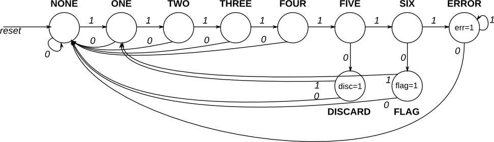
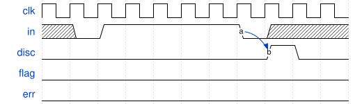
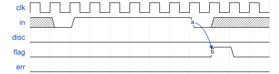
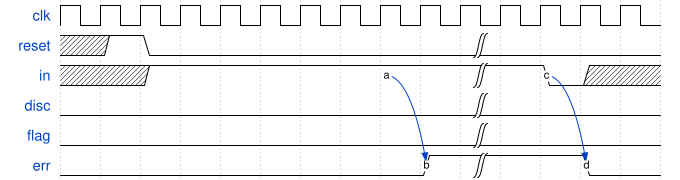

# 138. Sequence recognition

**Section:** Circuits — Sequential Logic — Finite State Machines  
**HDLBits:** [Sequence recognition](https://hdlbits.01xz.net/wiki/Fsm_hdlc)

## Problem

HDLC bit-stuffing detector. Search the serial stream for 0111110
(disc=1, bit to discard) and 01111110 (flag, done=1). Count
consecutive 1s after a 0. Synchronous reset.

## Figures (from HDLBits)

Copied from the official HDLBits problem page for this tutorial.









## Solution

The module is named `top_module` so you can paste it into HDLBits. The same source is in [`138_fsm_hdlc.v`](./138_fsm_hdlc.v).

```verilog
module top_module (
    input      clk,
    input      reset,
    input      in,
    output     disc,
    output     flag,
    output     err
);
    reg [3:0] ones, ones_n;
    always @(*) begin
        if (!in)
            ones_n = 4'd0;
        else if (ones < 4'd7)
            ones_n = ones + 4'd1;
        else
            ones_n = ones;
    end
    always @(posedge clk) begin
        if (reset)
            ones <= 4'd0;
        else
            ones <= ones_n;
    end
    assign disc = (ones == 4'd5) && (in == 1'b0);
    assign flag = (ones == 4'd6) && (in == 1'b0);
    assign err  = (ones >= 4'd7);
endmodule
```
