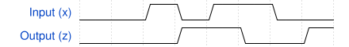

# 140. Q5a: Serial two's complementer (Moore FSM)

**Section:** Circuits — Sequential Logic — Finite State Machines  
**HDLBits:** [Q5a: Serial two's complementer (Moore FSM)](https://hdlbits.01xz.net/wiki/Exams/ece241_2014_q5a)

## Problem

Convert a serial bitstream to its two's complement, LSB first.
Moore machine: pass bits unchanged until the first 1, then invert
all subsequent bits. Synchronous reset starts a new number.

## Figures (from HDLBits)

Copied from the official HDLBits problem page for this tutorial.



## Solution

The module is named `top_module` so you can paste it into HDLBits. The same source is in [`140_ece241_2014_q5a.v`](./140_ece241_2014_q5a.v).

```verilog
module top_module (
    input      clk,
    input      areset,
    input      x,
    output     z
);
    parameter A=0, B=1;
    reg state;
    always @(posedge clk or posedge areset) begin
        if (areset)
            state <= A;
        else if (state == A && x)
            state <= B;
    end
    assign z = (state == A) ? x : ~x;
endmodule
```
