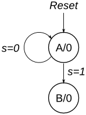
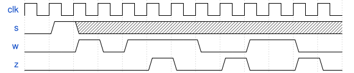

# 142. Q3a: FSM

**Section:** Circuits — Sequential Logic — Finite State Machines  
**HDLBits:** [Q3a: FSM](https://hdlbits.01xz.net/wiki/Exams/2014_q3fsm)

## Problem

FSM with states A..Z-like from the 2014 exam. Synchronous reset to A.
Typical behaviour: search for 1101 in `s`, then output `z` while
`w` is observed for two cycles... The exam figure:
  Start in A. If s=1 go to B else stay A.
  From B, if s=0 go C else stay B.
  From C if w=1 go to ... 
Standard 2014 Q3 FSM:
  A --s=1--> B --s=0--> C, then two-cycle check of w:
  if both cycles w=1 then z=1 else z=0, then back to A.

## Figures (from HDLBits)

Copied from the official HDLBits problem page for this tutorial.





## Solution

The module is named `top_module` so you can paste it into HDLBits. The same source is in [`142_2014_q3fsm.v`](./142_2014_q3fsm.v).

```verilog
module top_module (
    input      clk,
    input      reset,
    input      s,
    input      w,
    output     z
);
    parameter A=0, B=1, C1=2, C2=3, D=4;
    reg [2:0] state, next;
    reg [1:0] wcnt, wcnt_n;
    always @(*) begin
        next   = state;
        wcnt_n = wcnt;
        case (state)
            A:  next = s ? B : A;
            B:  begin
                    next   = C1;
                    wcnt_n = w ? 2'd1 : 2'd0;
                end
            C1: begin
                    next   = C2;
                    wcnt_n = wcnt + w;
                end
            C2: next = s ? B : A;
            default: next = A;
        endcase
    end
    always @(posedge clk) begin
        if (reset) begin
            state <= A;
            wcnt  <= 2'd0;
        end else begin
            state <= next;
            wcnt  <= wcnt_n;
        end
    end
    assign z = (state == C2) && (wcnt == 2'd2);
endmodule
```
