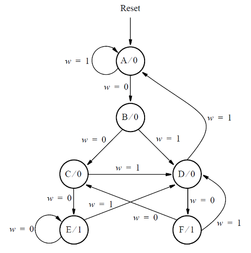

# 145. Q6b: FSM next-state logic

**Section:** Circuits — Sequential Logic — Finite State Machines  
**HDLBits:** [Q6b: FSM next-state logic](https://hdlbits.01xz.net/wiki/Exams/m2014_q6b)

## Problem

Given one-hot / binary state y[3:1] and input w, produce next-state
bit Y1 (the exam asks only for Y1).

## Figures (from HDLBits)

Copied from the official HDLBits problem page for this tutorial.



## Solution

The module is named `top_module` so you can paste it into HDLBits. The same source is in [`145_m2014_q6b.v`](./145_m2014_q6b.v).

```verilog
module top_module (
    input  [3:1] y,
    input        w,
    output       Y1
);
    assign Y1 = (y == 3'b000 && w)
              | (y == 3'b001 && w)
              | (y == 3'b011 && w)
              | (y == 3'b100 && w);
endmodule
```
