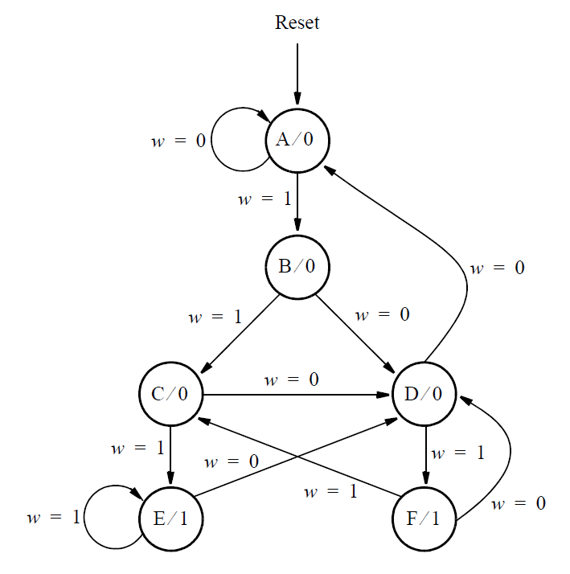

# 148. Q2a: FSM

**Section:** Circuits — Sequential Logic — Finite State Machines  
**HDLBits:** [Q2a: FSM](https://hdlbits.01xz.net/wiki/Exams/2012_q2fsm)

## Problem

2012 Q2 FSM. Asynchronous reset to state A. Inputs w, outputs z? 
Ports: clk, reset, w, z. Similar six-state machine; reset is
asynchronous in this version.

## Figures (from HDLBits)

Copied from the official HDLBits problem page for this tutorial.



## Solution

The module is named `top_module` so you can paste it into HDLBits. The same source is in [`148_2012_q2fsm.v`](./148_2012_q2fsm.v).

```verilog
module top_module (
    input      clk,
    input      reset,
    input      w,
    output     z
);
    parameter A=0, B=1, C=2, D=3, E=4, F=5;
    reg [2:0] state, next;
    always @(*) begin
        case (state)
            A: next = w ? B : A;
            B: next = w ? C : D;
            C: next = w ? E : D;
            D: next = w ? F : A;
            E: next = w ? E : D;
            F: next = w ? C : D;
            default: next = A;
        endcase
    end
    always @(posedge clk) begin
        if (reset)
            state <= A;
        else
            state <= next;
    end
    assign z = (state == E) || (state == F);
endmodule
```
