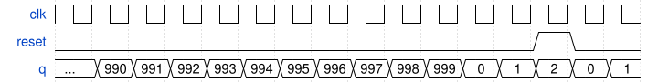

# 152. Counter with period 1000

**Section:** Circuits — Building Larger Circuits  
**HDLBits:** [Counter with period 1000](https://hdlbits.01xz.net/wiki/Exams/review2015_count1k)

## Problem

Count 0..999 then wrap. Synchronous reset to 0. Output q[9:0].

## Figures (from HDLBits)

Copied from the official HDLBits problem page for this tutorial.



## Solution

The module is named `top_module` so you can paste it into HDLBits. The same source is in [`152_review2015_count1k.v`](./152_review2015_count1k.v).

```verilog
module top_module (
    input            clk,
    input            reset,
    output reg [9:0] q
);
    always @(posedge clk) begin
        if (reset || q == 10'd999)
            q <= 10'd0;
        else
            q <= q + 10'd1;
    end
endmodule
```
