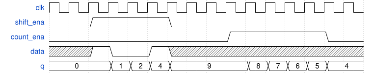

# 153. 4-bit shift register and down counter

**Section:** Circuits — Building Larger Circuits  
**HDLBits:** [4-bit shift register and down counter](https://hdlbits.01xz.net/wiki/Exams/review2015_shiftcount)

## Problem

Combined 4-bit shift register / down counter.
  shift_ena=1: shift in `data` at MSB (q <= {data, q[3:1]})
  count_ena=1: decrement q
If both, shift takes precedence. No reset.

## Figures (from HDLBits)

Copied from the official HDLBits problem page for this tutorial.



## Solution

The module is named `top_module` so you can paste it into HDLBits. The same source is in [`153_review2015_shiftcount.v`](./153_review2015_shiftcount.v).

```verilog
module top_module (
    input            clk,
    input            shift_ena,
    input            count_ena,
    input            data,
    output reg [3:0] q
);
    always @(posedge clk) begin
        if (shift_ena)
            q <= {q[2:0], data};
        else if (count_ena)
            q <= q - 4'd1;
    end
endmodule
```
