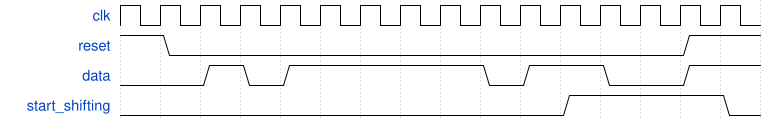

# 154. FSM: Sequence 1101 recognizer

**Section:** Circuits — Building Larger Circuits  
**HDLBits:** [FSM: Sequence 1101 recognizer](https://hdlbits.01xz.net/wiki/Exams/review2015_fsmseq)

## Problem

Detect the sequence 1101 on `data`. `start_shifting` goes 1 once
the sequence is seen and stays 1 until reset. Synchronous reset.

## Figures (from HDLBits)

Copied from the official HDLBits problem page for this tutorial.



## Solution

The module is named `top_module` so you can paste it into HDLBits. The same source is in [`154_review2015_fsmseq.v`](./154_review2015_fsmseq.v).

```verilog
module top_module (
    input      clk,
    input      reset,
    input      data,
    output     start_shifting
);
    parameter S0=0, S1=1, S11=2, S110=3, DONE=4;
    reg [2:0] state, next;
    always @(*) begin
        case (state)
            S0:   next = data ? S1   : S0;
            S1:   next = data ? S11  : S0;
            S11:  next = data ? S11  : S110;
            S110: next = data ? DONE : S0;
            DONE: next = DONE;
            default: next = S0;
        endcase
    end
    always @(posedge clk) begin
        if (reset)
            state <= S0;
        else
            state <= next;
    end
    assign start_shifting = (state == DONE);
endmodule
```
