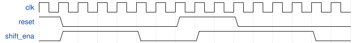

# 155. FSM: Enable shift register

**Section:** Circuits — Building Larger Circuits  
**HDLBits:** [FSM: Enable shift register](https://hdlbits.01xz.net/wiki/Exams/review2015_fsmshift)

## Problem

Assert `shift_ena` for exactly 4 clock cycles after reset, then 0
forever (until the next reset).

## Figures (from HDLBits)

Copied from the official HDLBits problem page for this tutorial.



## Solution

The module is named `top_module` so you can paste it into HDLBits. The same source is in [`155_review2015_fsmshift.v`](./155_review2015_fsmshift.v).

```verilog
module top_module (
    input      clk,
    input      reset,
    output     shift_ena
);
    reg [2:0] cnt;
    always @(posedge clk) begin
        if (reset)
            cnt <= 3'd0;
        else if (cnt < 3'd4)
            cnt <= cnt + 3'd1;
    end
    assign shift_ena = (cnt < 3'd4);
endmodule
```
