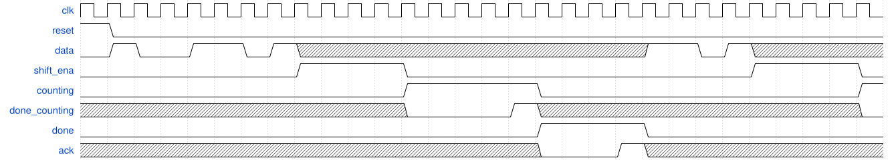

# 156. FSM: The complete FSM

**Section:** Circuits — Building Larger Circuits  
**HDLBits:** [FSM: The complete FSM](https://hdlbits.01xz.net/wiki/Exams/review2015_fsm)

## Problem

Timer FSM:
  1. Wait until `data` shows 1101 (as in fsmseq).
  2. Assert `shift_ena` for 4 cycles (shift in the delay).
  3. Wait until `done_counting`.
  4. Assert `done` and wait until `ack`, then restart.
Outputs: shift_ena, counting, done.

## Figures (from HDLBits)

Copied from the official HDLBits problem page for this tutorial.




## Solution

The module is named `top_module` so you can paste it into HDLBits. The same source is in [`156_review2015_fsm.v`](./156_review2015_fsm.v).

```verilog
module top_module (
    input      clk,
    input      reset,
    input      data,
    output     shift_ena,
    output     counting,
    input      done_counting,
    output     done,
    input      ack
);
    parameter S0=0, S1=1, S11=2, S110=3, SH=4, CNT=5, DN=6;
    reg [2:0] state, next;
    reg [2:0] shcnt, shcnt_n;
    always @(*) begin
        next    = state;
        shcnt_n = shcnt;
        case (state)
            S0:   next = data ? S1  : S0;
            S1:   next = data ? S11 : S0;
            S11:  next = data ? S11 : S110;
            S110: next = data ? SH  : S0;
            SH: begin
                    shcnt_n = shcnt + 3'd1;
                    if (shcnt == 3'd3)
                        next = CNT;
                end
            CNT:  if (done_counting) next = DN;
            DN:   if (ack) next = S0;
            default: next = S0;
        endcase
    end
    always @(posedge clk) begin
        if (reset) begin
            state <= S0;
            shcnt <= 3'd0;
        end else begin
            state <= next;
            if (next == SH && state != SH)
                shcnt <= 3'd0;
            else
                shcnt <= shcnt_n;
        end
    end
    assign shift_ena = (state == SH);
    assign counting  = (state == CNT);
    assign done      = (state == DN);
endmodule
```
