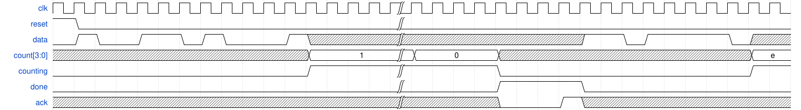

# 157. The complete timer

**Section:** Circuits — Building Larger Circuits  
**HDLBits:** [The complete timer](https://hdlbits.01xz.net/wiki/Exams/review2015_fancytimer)

## Problem

Full timer: search for 1101, shift in 4 bits (MSB first) as a delay
0..15, then count (delay+1)*1000 cycles, assert `done` until `ack`.
`count[9:0]` is the 0..999 inner counter (counts down from 999).
`counting` is 1 during the delay. Synchronous reset.

## Figures (from HDLBits)

Copied from the official HDLBits problem page for this tutorial.



## Solution

The module is named `top_module` so you can paste it into HDLBits. The same source is in [`157_review2015_fancytimer.v`](./157_review2015_fancytimer.v).

```verilog
module top_module (
    input            clk,
    input            reset,
    input            data,
    output [3:0]     count,
    output           counting,
    output           done,
    input            ack
);
    parameter S0=0, S1=1, S11=2, S110=3, SH=4, CNT=5, DN=6;
    reg [2:0]  state, next;
    reg [2:0]  shcnt;
    reg [3:0]  delay, delay_left;
    reg [9:0]  cyc;
    always @(*) begin
        next = state;
        case (state)
            S0:   next = data ? S1  : S0;
            S1:   next = data ? S11 : S0;
            S11:  next = data ? S11 : S110;
            S110: next = data ? SH  : S0;
            SH:   if (shcnt == 3'd3) next = CNT;
            CNT:  if (cyc == 10'd0 && delay_left == 4'd0) next = DN;
            DN:   if (ack) next = S0;
            default: next = S0;
        endcase
    end
    always @(posedge clk) begin
        if (reset) begin
            state      <= S0;
            shcnt      <= 3'd0;
            delay      <= 4'd0;
            delay_left <= 4'd0;
            cyc        <= 10'd999;
        end else begin
            state <= next;
            case (state)
                SH: begin
                    delay <= {delay[2:0], data};
                    shcnt <= shcnt + 3'd1;
                    if (shcnt == 3'd3) begin
                        delay_left <= {delay[2:0], data};
                        cyc        <= 10'd999;
                        shcnt      <= 3'd0;
                    end
                end
                CNT: begin
                    if (cyc == 10'd0) begin
                        cyc        <= 10'd999;
                        delay_left <= delay_left - 4'd1;
                    end else
                        cyc <= cyc - 10'd1;
                end
                default: shcnt <= 3'd0;
            endcase
        end
    end
    assign counting = (state == CNT);
    assign done     = (state == DN);
    assign count    = delay_left;
endmodule
```
