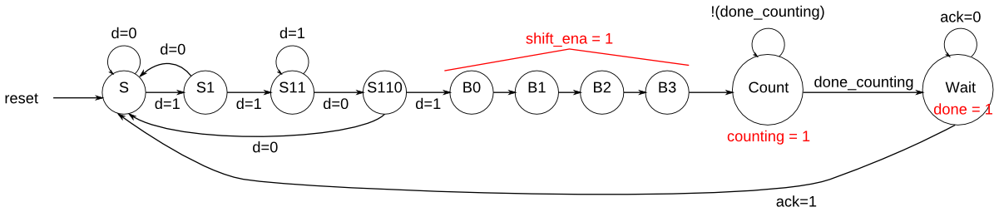

# 158. FSM: One-hot logic equations

**Section:** Circuits — Building Larger Circuits  
**HDLBits:** [FSM: One-hot logic equations](https://hdlbits.01xz.net/wiki/Exams/review2015_fsmonehot)

## Problem

One-hot next-state and output equations for the complete timer FSM.
Input `d` is the serial data, `done_counting`, `ack`.
State bits: B0,B1,B2,B3,Shift0..? HDLBits names:
  B0,B1,B2,B3, S0,S1,S2,S3, Count, Wait
(10 bits). Derive B0_next ... Wait_next, shift_ena, counting, done.

## Figures (from HDLBits)

Copied from the official HDLBits problem page for this tutorial.



## Solution

The module is named `top_module` so you can paste it into HDLBits. The same source is in [`158_review2015_fsmonehot.v`](./158_review2015_fsmonehot.v).

```verilog
module top_module (
    input      d,
    input      done_counting,
    input      ack,
    input      [9:0] state,
    output     [9:0] next_state,
    output     B3_next,
    output     S_next,
    output     S1_next,
    output     Count_next,
    output     Wait_next,
    output     done,
    output     counting,
    output     shift_ena
);
    // state[0]=S, [1]=S1, [2]=S11, [3]=S110,
    // [4]=B0, [5]=B1, [6]=B2, [7]=B3, [8]=Count, [9]=Wait
    wire S, S1, S11, S110, B0, B1, B2, B3, Count, Wait;
    assign {Wait, Count, B3, B2, B1, B0, S110, S11, S1, S} = state;

    assign S_next     = (~d & (S | S1 | S110)) | (Wait & ack);
    assign S1_next    = d & S;
    assign B3_next    = B2;
    assign Count_next = B3 | (Count & ~done_counting);
    assign Wait_next  = (Count & done_counting) | (Wait & ~ack);

    assign next_state[0] = S_next;
    assign next_state[1] = S1_next;
    assign next_state[2] = d & S1;          // S11
    assign next_state[3] = ~d & S11;        // S110
    assign next_state[4] = d & S110;        // B0
    assign next_state[5] = B0;              // B1
    assign next_state[6] = B1;              // B2
    assign next_state[7] = B3_next;         // B3
    assign next_state[8] = Count_next;
    assign next_state[9] = Wait_next;

    assign shift_ena = B0 | B1 | B2 | B3;
    assign counting  = Count;
    assign done      = Wait;
endmodule
```
