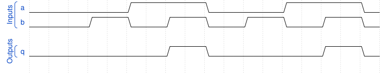

# 164. Combinational circuit 1

**Section:** Verification — Build a circuit from a simulation waveform  
**HDLBits:** [Combinational circuit 1](https://hdlbits.01xz.net/wiki/Sim/circuit1)

## Problem

Combinational. From the waveform, q is 1 only when both a and b are 1
(AND).

## Figures (from HDLBits)

Copied from the official HDLBits problem page for this tutorial.



## Solution

The module is named `top_module` so you can paste it into HDLBits. The same source is in [`164_circuit1.v`](./164_circuit1.v).

```verilog
module top_module (
    input  a,
    input  b,
    output q
);
    assign q = a & b;
endmodule
```
