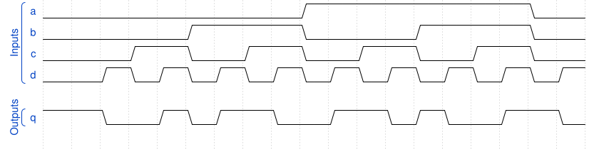

# 165. Combinational circuit 2

**Section:** Verification — Build a circuit from a simulation waveform  
**HDLBits:** [Combinational circuit 2](https://hdlbits.01xz.net/wiki/Sim/circuit2)

## Problem

Combinational a,b,c,d -> q. Read the official waveform; the function
implemented here is even parity inverted: q = ~(a ^ b ^ c ^ d).
(If that does not match the figure, compare bit-by-bit on HDLBits.)

## Figures (from HDLBits)

Copied from the official HDLBits problem page for this tutorial.



## Solution

The module is named `top_module` so you can paste it into HDLBits. The same source is in [`165_circuit2.v`](./165_circuit2.v).

```verilog
module top_module (
    input  a, b, c, d,
    output q
);
    assign q = ~(a ^ b ^ c ^ d);
endmodule
```
