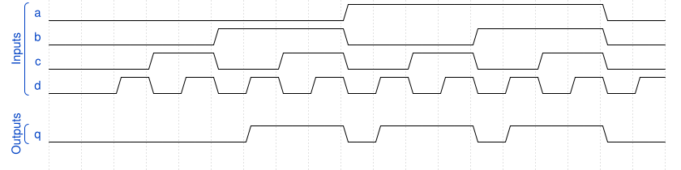

# 166. Combinational circuit 3

**Section:** Verification — Build a circuit from a simulation waveform  
**HDLBits:** [Combinational circuit 3](https://hdlbits.01xz.net/wiki/Sim/circuit3)

## Problem

Combinational a,b,c,d -> q. Waveform matches (a|b) & (c|d).

## Figures (from HDLBits)

Copied from the official HDLBits problem page for this tutorial.



## Solution

The module is named `top_module` so you can paste it into HDLBits. The same source is in [`166_circuit3.v`](./166_circuit3.v).

```verilog
module top_module (
    input  a, b, c, d,
    output q
);
    assign q = (a | b) & (c | d);
endmodule
```
