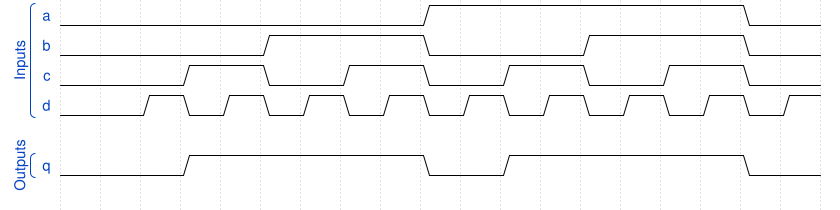

# 167. Combinational circuit 4

**Section:** Verification — Build a circuit from a simulation waveform  
**HDLBits:** [Combinational circuit 4](https://hdlbits.01xz.net/wiki/Sim/circuit4)

## Problem

Combinational a,b,c,d -> q. Waveform matches q = b (q follows b).

## Figures (from HDLBits)

Copied from the official HDLBits problem page for this tutorial.



## Solution

The module is named `top_module` so you can paste it into HDLBits. The same source is in [`167_circuit4.v`](./167_circuit4.v).

```verilog
module top_module (
    input  a, b, c, d,
    output q
);
    assign q = b;
endmodule
```
