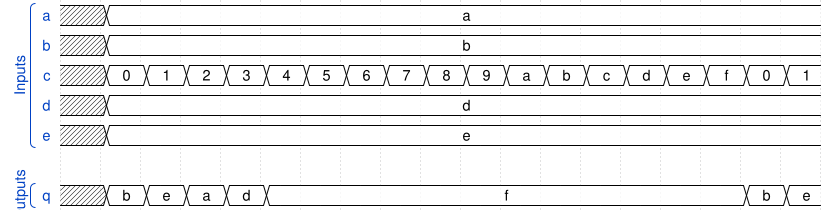
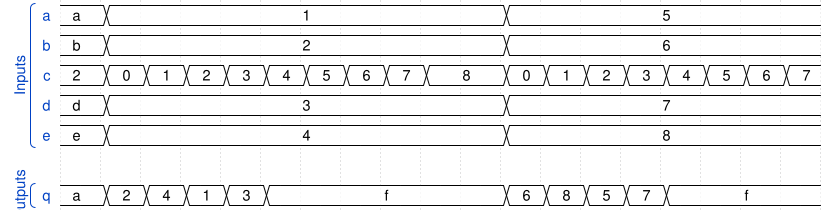

# 168. Combinational circuit 5

**Section:** Verification — Build a circuit from a simulation waveform  
**HDLBits:** [Combinational circuit 5](https://hdlbits.01xz.net/wiki/Sim/circuit5)

## Problem

Five 4-bit inputs a,b,c,d,e and 4-bit q. From the official waveform,
`c` selects among the other buses (0->b, 1->e, 2->a, 3->d) and q is
4'hf for any other select value. Compare the figure on HDLBits.

## Figures (from HDLBits)

Copied from the official HDLBits problem page for this tutorial.





## Solution

The module is named `top_module` so you can paste it into HDLBits. The same source is in [`168_circuit5.v`](./168_circuit5.v).

```verilog
module top_module (
    input  [3:0] a, b, c, d, e,
    output [3:0] q
);
    assign q = (c == 4'd0) ? b :
               (c == 4'd1) ? e :
               (c == 4'd2) ? a :
               (c == 4'd3) ? d :
               4'hf;
endmodule
```
