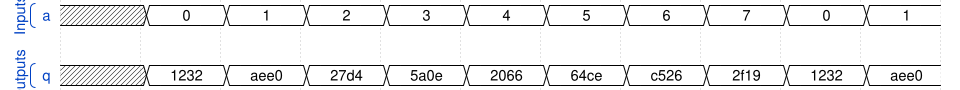

# 169. Combinational circuit 6

**Section:** Verification — Build a circuit from a simulation waveform  
**HDLBits:** [Combinational circuit 6](https://hdlbits.01xz.net/wiki/Sim/circuit6)

## Problem

a[2:0] -> q[15:0]. The waveform is a lookup table of 8 constants.
Standard values:
  0: 1232, 1: aee0, 2: 27d4, 3: 5a0e, 4: 2066, 5: 64ce, 6: c526, 7: 2f19
(hex).

## Figures (from HDLBits)

Copied from the official HDLBits problem page for this tutorial.



## Solution

The module is named `top_module` so you can paste it into HDLBits. The same source is in [`169_circuit6.v`](./169_circuit6.v).

```verilog
module top_module (
    input      [2:0]  a,
    output reg [15:0] q
);
    always @(*) begin
        case (a)
            3'd0: q = 16'h1232;
            3'd1: q = 16'haee0;
            3'd2: q = 16'h27d4;
            3'd3: q = 16'h5a0e;
            3'd4: q = 16'h2066;
            3'd5: q = 16'h64ce;
            3'd6: q = 16'hc526;
            3'd7: q = 16'h2f19;
        endcase
    end
endmodule
```
