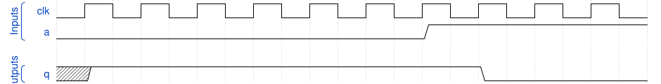

# 170. Sequential circuit 7

**Section:** Verification — Build a circuit from a simulation waveform  
**HDLBits:** [Sequential circuit 7](https://hdlbits.01xz.net/wiki/Sim/circuit7)

## Problem

Sequential. q is a register that loads 0 when `a` is 1, and 1 when
`a` is 0, on the clock edge (i.e. q <= ~a). From the waveform q
follows ~a delayed one cycle.

## Figures (from HDLBits)

Copied from the official HDLBits problem page for this tutorial.



## Solution

The module is named `top_module` so you can paste it into HDLBits. The same source is in [`170_circuit7.v`](./170_circuit7.v).

```verilog
module top_module (
    input      clk,
    input      a,
    output reg q
);
    always @(posedge clk)
        q <= ~a;
endmodule
```
