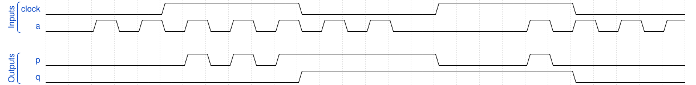

# 171. Sequential circuit 8

**Section:** Verification — Build a circuit from a simulation waveform  
**HDLBits:** [Sequential circuit 8](https://hdlbits.01xz.net/wiki/Sim/circuit8)

## Problem

Sequential with clock named `clock`. p is a latch of `a` while clock
is high (transparent when clock=1). q is a negative-edge register
of p (or of a). Standard:
  always @(*) if (clock) p = a;
  always @(negedge clock) q <= p;

## Figures (from HDLBits)

Copied from the official HDLBits problem page for this tutorial.



## Solution

The module is named `top_module` so you can paste it into HDLBits. The same source is in [`171_circuit8.v`](./171_circuit8.v).

```verilog
module top_module (
    input      clock,
    input      a,
    output reg p,
    output reg q
);
    always @(*) begin
        if (clock)
            p = a;
    end
    always @(negedge clock)
        q <= p;
endmodule
```
