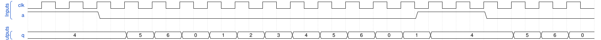

# 172. Sequential circuit 9

**Section:** Verification — Build a circuit from a simulation waveform  
**HDLBits:** [Sequential circuit 9](https://hdlbits.01xz.net/wiki/Sim/circuit9)

## Problem

q[3:0] counts 0..5 (or similar) while a=0, and resets to 0 (or 4)
when a=1. From the common waveform: when a=1, q=4; when a=0, q
counts 4,5,0,1,2,3,4,... each clock.

## Figures (from HDLBits)

Copied from the official HDLBits problem page for this tutorial.



## Solution

The module is named `top_module` so you can paste it into HDLBits. The same source is in [`172_circuit9.v`](./172_circuit9.v).

```verilog
module top_module (
    input            clk,
    input            a,
    output reg [3:0] q
);
    always @(posedge clk) begin
        if (a)
            q <= 4'd4;
        else if (q == 4'd6)
            q <= 4'd0;
        else
            q <= q + 4'd1;
    end
endmodule
```
