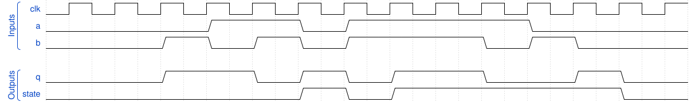

# 173. Sequential circuit 10

**Section:** Verification — Build a circuit from a simulation waveform  
**HDLBits:** [Sequential circuit 10](https://hdlbits.01xz.net/wiki/Sim/circuit10)

## Problem

Sequential circuit with inputs a,b and outputs q, state. From the
waveform: `state` updates to `a` when a==b (otherwise holds), and
q equals a when a==b else ~state. Confirm against the official plot.

## Figures (from HDLBits)

Copied from the official HDLBits problem page for this tutorial.



## Solution

The module is named `top_module` so you can paste it into HDLBits. The same source is in [`173_circuit10.v`](./173_circuit10.v).

```verilog
module top_module (
    input      clk,
    input      a,
    input      b,
    output     q,
    output reg state
);
    always @(posedge clk) begin
        if (a == b)
            state <= a;
    end
    assign q = (a == b) ? a : ~state;
endmodule
```
