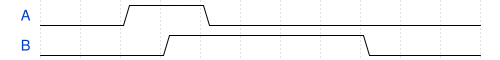

# 175. Testbench1

**Section:** Verification — Writing Testbenches  
**HDLBits:** [Testbench1](https://hdlbits.01xz.net/wiki/Tb/tb1)

## Problem

Pulse `in` : 0 for 10 units, 1 for 10 units, then $finish.
DUT ports: in, out. Create the stimulus only (plus a stub DUT here).

## Figures (from HDLBits)

Copied from the official HDLBits problem page for this tutorial.



## Solution

The module is named `top_module` so you can paste it into HDLBits. The same source is in [`175_tb_tb1.v`](./175_tb_tb1.v).

```verilog
`timescale 1ns/1ps
module top_module;
    reg  in;
    wire out;
    dut dut (.in(in), .out(out));
    initial begin
        in = 1'b0;
        #10 in = 1'b1;
        #10 $finish;
    end
endmodule

module dut (input in, output out);
    assign out = in;
endmodule
```
