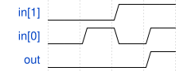

# 176. AND gate

**Section:** Verification — Writing Testbenches  
**HDLBits:** [AND gate](https://hdlbits.01xz.net/wiki/Tb/and)

## Problem

Testbench for an AND gate. Apply all four combinations of `in[1:0]`
for 10 time units each, then $finish. DUT: andgate (.in(in), .out(out)).

## Figures (from HDLBits)

Copied from the official HDLBits problem page for this tutorial.



## Solution

The module is named `top_module` so you can paste it into HDLBits. The same source is in [`176_tb_and.v`](./176_tb_and.v).

```verilog
`timescale 1ns/1ps
module top_module;
    reg  [1:0] in;
    wire       out;
    andgate dut (.in(in), .out(out));
    initial begin
        in = 2'b00; #10;
        in = 2'b01; #10;
        in = 2'b10; #10;
        in = 2'b11; #10;
        $finish;
    end
endmodule

module andgate (input [1:0] in, output out);
    assign out = in[1] & in[0];
endmodule
```
