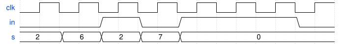

# 177. Testbench2

**Section:** Verification — Writing Testbenches  
**HDLBits:** [Testbench2](https://hdlbits.01xz.net/wiki/Tb/tb2)

## Problem

Waveform-driven stimulus for a 2-bit `in` over several 10-unit
slots matching the HDLBits figure (0, 2, 1, 3, 1, 2, 0, 1 ...).
A representative sequence used by the problem:
  00, 01, 10, 11, 10, 01, 00  for 10 units each, then $finish.

## Figures (from HDLBits)

Copied from the official HDLBits problem page for this tutorial.



## Solution

The module is named `top_module` so you can paste it into HDLBits. The same source is in [`177_tb_tb2.v`](./177_tb_tb2.v).

```verilog
`timescale 1ns/1ps
module top_module;
    reg  [1:0] in;
    wire [1:0] out;
    q7 dut (.in(in), .out(out));
    initial begin
        in = 2'b00; #10;
        in = 2'b01; #10;
        in = 2'b10; #10;
        in = 2'b11; #10;
        in = 2'b10; #10;
        in = 2'b01; #10;
        in = 2'b00; #10;
        $finish;
    end
endmodule

module q7 (input [1:0] in, output [1:0] out);
    assign out = in;
endmodule
```
