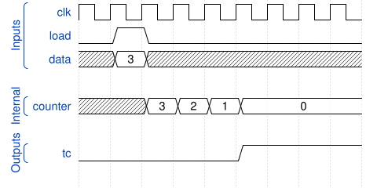

# 179. Timer

**Section:** CS450  
**HDLBits:** [Timer](https://hdlbits.01xz.net/wiki/Cs450/timer)

## Problem

Down-counter timer. If `load`=1, load the 10-bit `data` as the
remaining count. Otherwise decrement (saturating at 0). `tc` is 1
when the count is 0.

## Figures (from HDLBits)

Copied from the official HDLBits problem page for this tutorial.



## Solution

The module is named `top_module` so you can paste it into HDLBits. The same source is in [`179_timer.v`](./179_timer.v).

```verilog
module top_module (
    input        clk,
    input        load,
    input  [9:0] data,
    output       tc
);
    reg [9:0] cnt;
    always @(posedge clk) begin
        if (load)
            cnt <= data;
        else if (cnt != 10'd0)
            cnt <= cnt - 10'd1;
    end
    assign tc = (cnt == 10'd0);
endmodule
```
