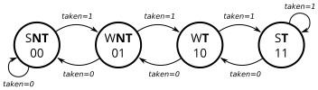

# 180. Counter 2bc

**Section:** CS450  
**HDLBits:** [Counter 2bc](https://hdlbits.01xz.net/wiki/Cs450/counter_2bc)

## Problem

2-bit saturating counter for branch prediction. `areset` (async)
to weakly not-taken (2'b01). When `train_valid`:
  train_taken=1: increment up to 3
  train_taken=0: decrement down to 0
Output `state[1:0]` is the count (MSB is the prediction).

## Figures (from HDLBits)

Copied from the official HDLBits problem page for this tutorial.



## Solution

The module is named `top_module` so you can paste it into HDLBits. The same source is in [`180_counter_2bc.v`](./180_counter_2bc.v).

```verilog
module top_module (
    input        clk,
    input        areset,
    input        train_valid,
    input        train_taken,
    output [1:0] state
);
    reg [1:0] st;
    always @(posedge clk or posedge areset) begin
        if (areset)
            st <= 2'b01;
        else if (train_valid) begin
            if (train_taken)
                st <= (st == 2'b11) ? 2'b11 : st + 2'd1;
            else
                st <= (st == 2'b00) ? 2'b00 : st - 2'd1;
        end
    end
    assign state = st;
endmodule
```
