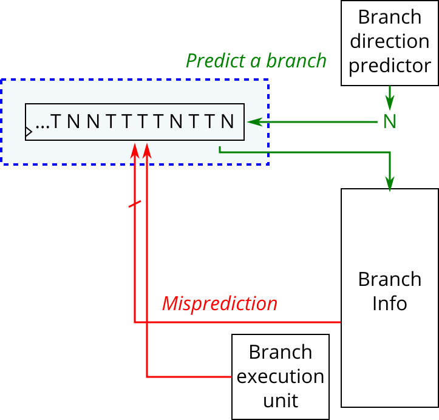

# 181. History shift

**Section:** CS450  
**HDLBits:** [History shift](https://hdlbits.01xz.net/wiki/Cs450/history_shift)

## Problem

32-bit speculative global branch-history register.
  predict_valid: shift `predict_taken` in at the LSB.
  train_mispredicted: load {train_history[30:0], train_taken}
    (history before the branch concatenated with the real outcome).
Mispredict takes precedence over predict. `areset` to 0.
`predict_history` is the register value.

## Figures (from HDLBits)

Copied from the official HDLBits problem page for this tutorial.



## Solution

The module is named `top_module` so you can paste it into HDLBits. The same source is in [`181_history_shift.v`](./181_history_shift.v).

```verilog
module top_module (
    input             clk,
    input             areset,
    input             predict_valid,
    input             predict_taken,
    output     [31:0] predict_history,
    input             train_mispredicted,
    input             train_taken,
    input      [31:0] train_history
);
    reg [31:0] hist;
    always @(posedge clk or posedge areset) begin
        if (areset)
            hist <= 32'd0;
        else if (train_mispredicted)
            hist <= {train_history[30:0], train_taken};
        else if (predict_valid)
            hist <= {hist[30:0], predict_taken};
    end
    assign predict_history = hist;
endmodule
```
