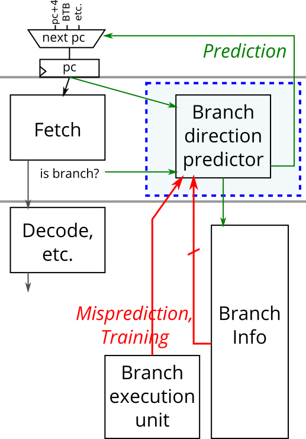
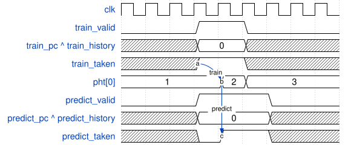

# 182. Gshare

**Section:** CS450  
**HDLBits:** [Gshare](https://hdlbits.01xz.net/wiki/Cs450/gshare)

## Problem

7-bit gshare predictor: 128-entry table of 2-bit saturating counters,
index = pc XOR history. 7-bit global history register.
  predict_valid: predict_taken = PHT[hist^pc][1], then (next cycle)
    shift the *prediction* into history (unless a train+mispredict
    wins).
  train_valid: update PHT[train_history ^ train_pc] toward
    train_taken (saturating). If train_mispredicted, history
    becomes {train_history[5:0], train_taken}.
Training and predicting in the same cycle: both PHT update and
(if mispredict) history recovery occur; otherwise if only predict,
history shifts. `areset`: PHT entries to 2'b01, history to 0.
Output `predict_history` is the current history used for the
prediction (before the shift).

## Figures (from HDLBits)

Copied from the official HDLBits problem page for this tutorial.





## Solution

The module is named `top_module` so you can paste it into HDLBits. The same source is in [`182_gshare.v`](./182_gshare.v).

```verilog
module top_module (
    input         clk,
    input         areset,
    input         predict_valid,
    input  [6:0]  predict_pc,
    output        predict_taken,
    output [6:0]  predict_history,
    input         train_valid,
    input         train_taken,
    input         train_mispredicted,
    input  [6:0]  train_history,
    input  [6:0]  train_pc
);
    reg [1:0] pht [0:127];
    reg [6:0] hist;
    integer i;
    wire [6:0] pred_index  = hist ^ predict_pc;
    wire [6:0] train_index = train_history ^ train_pc;

    assign predict_history = hist;
    assign predict_taken   = pht[pred_index][1];

    always @(posedge clk or posedge areset) begin
        if (areset) begin
            hist <= 7'd0;
            for (i = 0; i < 128; i = i + 1)
                pht[i] <= 2'b01;
        end else begin
            if (train_valid) begin
                if (train_taken)
                    pht[train_index] <= (pht[train_index] == 2'b11)
                                        ? 2'b11 : pht[train_index] + 2'd1;
                else
                    pht[train_index] <= (pht[train_index] == 2'b00)
                                        ? 2'b00 : pht[train_index] - 2'd1;
            end
            if (train_valid && train_mispredicted)
                hist <= {train_history[5:0], train_taken};
            else if (predict_valid)
                hist <= {hist[5:0], predict_taken};
        end
    end
endmodule
```
